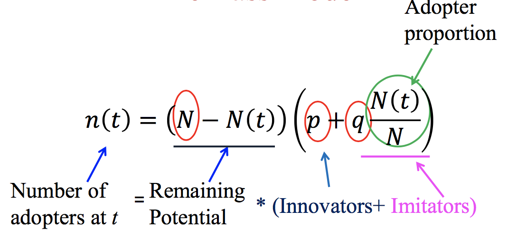
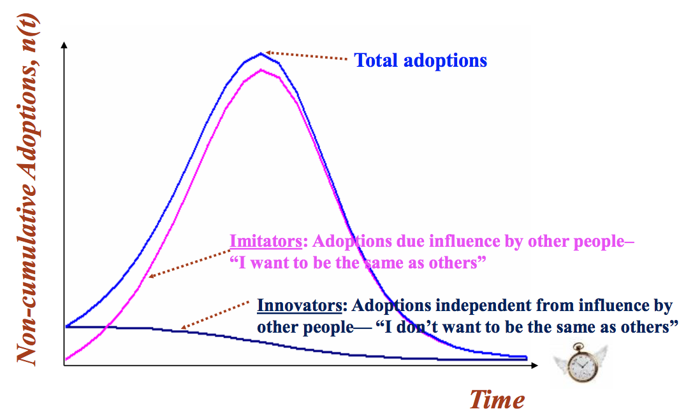
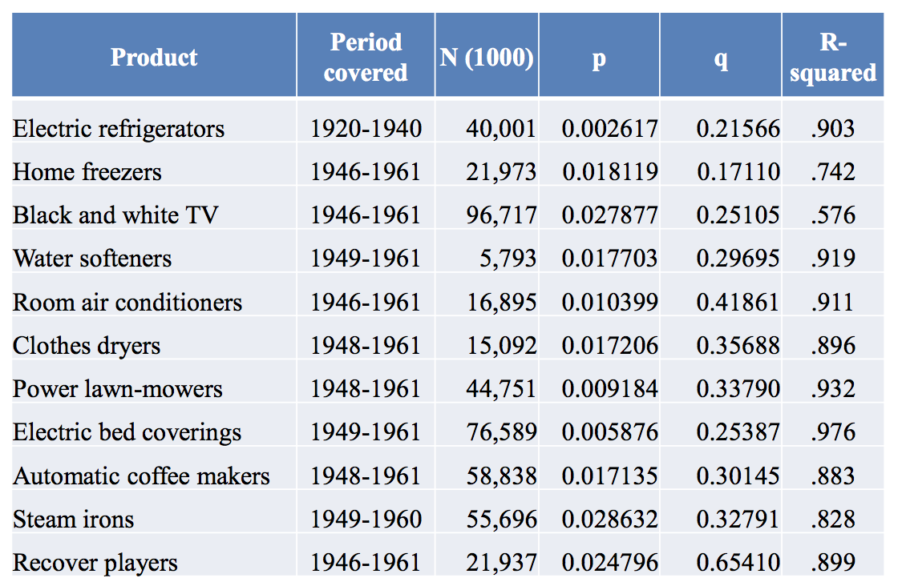
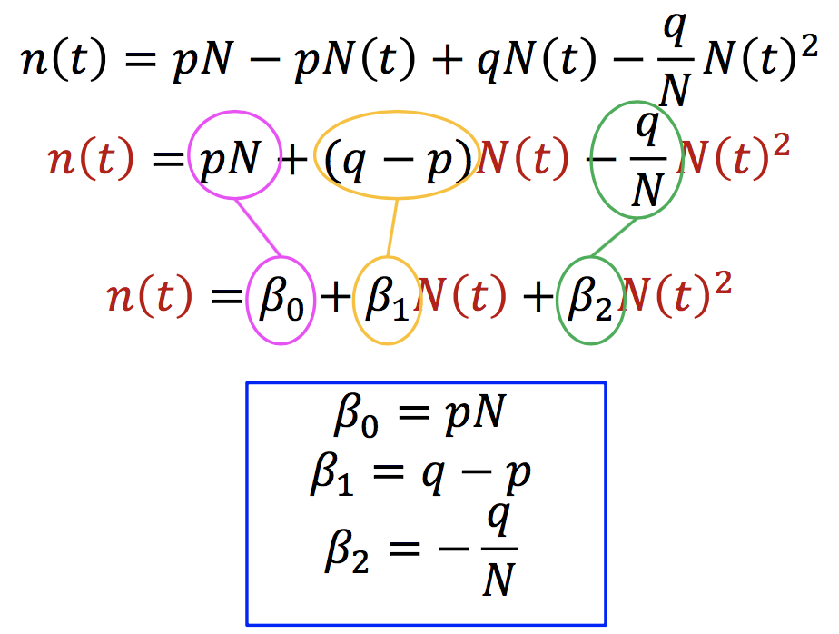
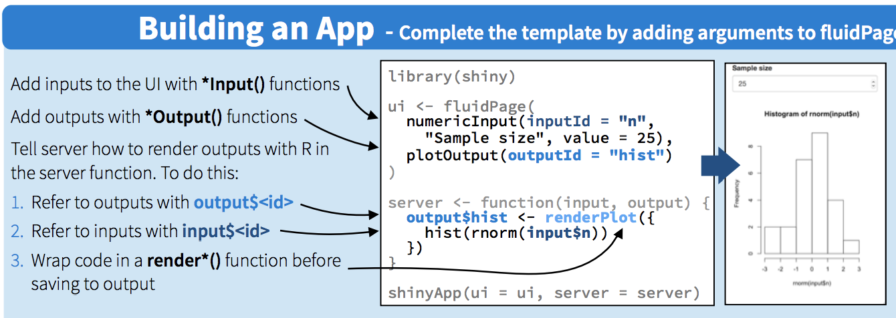

Sales forecasting is an interesting problem to almost all insitutions. Depending on the nature of the institution and its business priorities, "sales" could mean different measurements of some outcomes. For example, it could be the sales of a product, the sales of a type of service, or it could be the number of new subscribers. It has been a challenge to come up with a robust way of forecasting what will happen in the future. So that companies can plan ahead, such as investment decision, resource allocations and business partner negotiations, etc. 

When companies realized they have data that are of potential values to business, one of the most common first usage of such data potential is for forecasting. Forecsting is a challenge problem, and researchers have developed many methodologies to conduct forecasting, many of those falls in the area of time series modeling. We do offer a separate course on that, where different models will be discussed in details regarding how to capture the data pattern overtime. Recently machine learning models have developed for forecasting as well, focusing on the pattern in the data. 

While I'll leave those discussions to the dedicated course, in this course, we are going to discuss a very special type of forecasting model, the BASS model. 

The Bass model is designed for only new products. It answers the forecasting question from a slighly different angle. Forecasting usually answers how many products will be sold in each time period. Bass model think it from the customer adoption perspective. ** A shift from product focus to customer focus.**  It answers the question, in each time period, how many customers are going to buy the product. In Marketing, this is also called Product Diffusion Process. 


```{r setup, include=FALSE}

# knitr::opts_chunk$set(echo = FALSE)

```

### Product and Innovation Diffusion

#### Our goal: To describes the process of how new products get adopted in a population. 
- When will customers adopt a New Product?
- How long for new product to reach peak sales?
- What will be the peak sales?

#### Bass Model
* Bass model introduction
    * For diffusion of new product category
    * It answers the question:**How many customers adopt a new product at each time period?**
    * It uses a stylized model to describe the new product adoption process.

* Bass model implementation
    * Bass Modal Setup: Only two types of customers，they are
        * <font color=Crimson>Innovators</font>: the proportion of innovators among all customers who have **not** adopted the product is **p**  
        * <font color=HotPink>Imitators</font>: a scale parameter indicating the word of mouth effect is **q**  
    <div  align="center">    
    
    
    </div>  
    * Bass Model Variables
        * n(t):predicted sales in time t
        * N(t):total number of adaptors before t  
          where   N(t)=n(0)+n(1)+...+n(t-1)  
        * p:coefficient of innovation
        * q:coefficient of imitaion
        * N: market potential
    * Average value of p and q
        * Van den Bulte and Stremersch(2004) suggest an average value of ** 0.03 for q ** and ** 0.42 for q**   
    <div  align="center">    
      
    </div>  
    * How to Obtain p, q and N ?
        * When no data - borrow information
            * Borrow p,q
            * Predict N
        * Chain ratio method
        * Survey on intention to buy
    * When you have data - Linear Regression
        * It can estimate p, q and N  
        $$ n(t)=(N-N(t))(p+qN(t)/N) $$  
        * Estimate the Bass Model(N,p,q) 
      <div  align="center">    
       
      </div>  
      The advantage is we only need three parameters p, q and N. It is a simple model that captures the essence of reality. And there is no need to know when the product was launched.  
    * Assumptions made in Bass Model $$ n(t)=(N-N(t)(p+qN(t)/N)) $$
    * Assumptions:
        * The total market potential N remains the same
        * No reperchase of the product
        * The word of mouth effect stays the same across time
        * Every customer in the market will eventually adopt the product  
    * Limitations of Bass Model
        * Not for a particular brand in a competitive market
        * Not for non-durable products
        * No marketing mix variables  
            * Extension model in the Bass 2004 paper
        * Not for successive generations of technology
            * Extension model in the Bass 2004 paper  
* Calibration  
    How can we get coefficients p and q? Given we have the current sales history of the product, we can ust it to fit the adoption curve.  
    $$\beta_{1}=q-p=-N\beta_{2}-\frac{\beta_{0}}{N}$$  
    we obtain a quadratic equation in N:  
    $$\beta_{2}N^{2}+\beta_{1}N+\beta_{0}=0$$  
    Solving we have  
    $$ N=\frac{-\beta_{1}\pm\sqrt{\beta_{1}^{2}-4\beta_{0}\beta_{2}}}{2\beta_{2}}$$
    
    and then this value of N may be used to solve for  
    $$p=\frac{\beta_{0}}{N}$$
    $$q=-m\beta_{2}$$

### Example Data
We have downloaded 4 data files for your class exercise and homework, which include:   
* **EVMon.csv** and **EVQtr.csv** Monthly and quarterly sales data on electric vehicel (EV), from Jan 2012 to August 2017. EVMon.csv is for monthly sales; EVQtr.csv is for quarterly sales;  
* **iPhone.csv**  Quarterly sales data on iPhone, from the 3rd quarter of 2007 to the 4th quarter 2012.   
* **TAD.csv** Annual sales data on Telephone Answering Device, from 1982 to 2010.  
* **VCR.csv** Annual sales data on Video Cassette Recorder, from 1974 to 2009.

Each of these data files has 3 columns, 
* The first column identifies the year
* The second column identifies the month (for monthly data) or the quarter (for quarterly data) 
* The third column lists the number of units sold

#### Setup and Get ready
```{r}

# set work directory
setwd("C:/Users/xjdong/Google Drive/Teaching/2017_09_Analytics_useR/Lecture 6 Bass Model")
# clear environment
rm(list=ls())

# set the maximum number of digits to be displayed to prevent scientific counting
options(scipen = 9)

```

#### Apply Shiny to make data set interactive with plot
  Shiny is an R package that makes it easy to build interactive web applications (apps) from R. It is an easy tool to learn, but can produce impressive effects, especially for presentations. To learn more about it, please refer to this [Shiny tutorial](http://https://shiny.rstudio.com/tutorial/). You will also find this [shiny cheatsheet](http://shiny.rstudio.com/images/shiny-cheatsheet.pdf) helpful. 
  
First, you need to install the Shiny package, use `install.packages("shiny")`. 

```{r}

# install.packages("shiny")
library(shiny)

```

#### Interactive Plot
  
  Shiny apps have two components: a user interface definition `ui`, including input and output specifications and formats; and a `server` script, for data processing. 
  
  <div  align="center">    
    
  </div>   
  

In this Shiny app we are buidling, we allow user to be able to select a list of files from his computer, and present the forecasting results based on each data input.

In order to do that, we define the following `fileInput` box, which allows users to select data files named `*.csv` or `*.txt`. To learn more about this, please refer to the introduction to [File Upload Control](https://shiny.rstudio.com/reference/shiny/latest/fileInput.html). 

According to the following code, the datafile selected by the user will be referred to as "file1"

```{r}

fileInput(inputId = "file1", label = "Choose data file", multiple = TRUE,
          accept = c("text/csv",
                     "text/comma-separated-values,text/plain",
                     ".csv"))
```


#### Connect Web UI to reactive output

In most programming, when the input datafile is changed, you need to re-run the program, to allow the program to generate a different set of results corresponding to the new datafile. In building an online application, Shiny helps you to avoid re-running your code by providing `reactive programming`. 

The reactive programming involves to steps:   

* Add an R object to your user interface.
* Tell Shiny how to build the object in the `server` function. The object will be reactivated if the code that builds it calls for an input from the user.

To gain deeper understanding about reactive programming, here are a few good references    
* [Create a reactive expression](https://shiny.rstudio.com/reference/shiny/latest/reactive.html)   
* [Reactive programming](https://en.wikipedia.org/wiki/Reactive_programming).


Next we will define a list of `reactive` functions. 

The following on read in the data file as specified by the user, and remove the rows or columns if they have no values in the whole row or the column. 

```{r}

datasetInput <- reactive({
    # if no input file then terminate.
    req(input$file1)
    # load data from file1 to data frame named "dataset".
    dataset <- read.csv(input$file1$datapath, header = TRUE)
    # if dataset have all values are NA row or colomn , then delete the row or the column.
    dataset <- dataset[apply(dataset, 1, function(x) !all(is.na(x))), 
                       apply(dataset, 2, function(x) !all(is.na(x)))]
    dataset 
})

```

In each of the possible data files, there are three columns   
* the first column is "year"
* the second column is "month" or "quarter"
* the third column is the unit sales in that time period   

Now after reading in the datafile into a `data.frame` called `dataset`, we get rid of the data for the first year, as they do not start from the first month/quarter of the first year. 


```{r}
date_2 <- reactive({
  dataset <- datasetInput()
  firstyr <- dataset[1, 1]
  dataset[dataset[, 1] == firstyr + 1, 2]  # The 2nd year is a complete cycle.
})

```

#### Output a select box to change the start period according to dataset.  

The above part of the Shiny app allows us to select a different data file for multiple exercises. Once we select the data file, we want to be able to select part of the data for the Bass model exercise, by selecting the start and ending periods. This would allow us to check whether the model results look very different when we use different periods of data for the Bass model analysis. 


```{r}

renderUI({
  dataset <- datasetInput()
  tagList(
    # set the output box label is the name of dataset column.
    selectInput(inputId = "start_date_1", label = paste("start", names(dataset)[1]), choices = unique(dataset[, 1]))
  )
})

# For monthly or quarterly data
renderUI({
  dataset <- datasetInput()
  tagList(
    if (ncol(dataset) > 2) {
      selectInput(inputId = "start_date_2", label = paste("start", names(dataset)[2]), choices = dataset[dataset[, 1] == input$start_date_1, 2])
    }
  )
})

#For period end time
renderUI({
  dataset <- datasetInput()
  tagList(
    selectInput(inputId = "end_date_1", label = paste("end", names(dataset)[1]), 
                choices = rev(unique(dataset[, 1])))
  )
})

#For period end time with month or quarter
renderUI({
  dataset <- datasetInput()
  tagList(
    if (ncol(dataset) > 2) {
      selectInput(inputId = "end_date_2", label = paste("end", names(dataset)[2]), 
                  choices = rev(dataset[dataset[, 1] == input$end_date_1, 2]))
    }
  )
})

```

The time period of start and end is set to the current value of the selected box by user's selection. `as.numeric()` transform the string about the year or quarter into numbers.
If there is no month or quarter data from seleced file, just return 1 for further processing.

```{r}

# set start year
start_date_1 <- reactive({
  req(input$start_date_1)
  as.numeric(input$start_date_1)
})

#set start month or quarter
start_date_2 <- reactive({
  dataset <- datasetInput()
  if (ncol(dataset) == 2) {
    1
  }
  else {
    req(input$start_date_2)
    which(date_2() == input$start_date_2)
  }
})

# set end year
end_date_1 <- reactive({
  req(input$end_date_1)
  as.numeric(input$end_date_1)
})

#set end month or quarter
end_date_2 <- reactive({
  dataset <- datasetInput()
  if (ncol(dataset) == 2) {
    1
  }
  else {
    req(input$end_date_2)
    which(date_2() == input$end_date_2)
  }
})

```

#### Compute p,q and N from selected history data.

After reading in the data file and specifying the start and end time period for your data, we can estimate the BASS model parameters using the following code. Note that we still need to use the `reactive` programming. 

```{r}

updateSales <- reactive({
  dataset <- datasetInput()
  # Set data from number to time series named Sales.
  if (ncol(dataset) == 2) {#only year
    init_date_2 <- 1
  }
  else {
    init_date_2 <- which(date_2() == dataset[1, 2])# year+month(quarter)
  }
  # put the unit sales information into a time series object, and call it Sales. Using time series object would make later process easier. 
  Sales <- ts(dataset[, ncol(dataset)], start = c(dataset[1, 1], init_date_2), freq = length(date_2()))
  
 
  # The function window set start and end 
  window(Sales, start = c(start_date_1(), start_date_2()), end = c(end_date_1(), end_date_2()))
  
})

# Cumulative sales
updateY <- reactive({
  Y <- cumsum(updateSales())
  # To time series
  ts(Y, start = c(start_date_1(), start_date_2()), freq = length(date_2()))
})

# To get p,q,N
updatePQN <- reactive({
  Sales <- updateSales()
  Y <- updateY()
  Y <- c(0, Y[1:(length(Y) - 1)]) # we want Y_t-1 not Y_t. Y_0=0
  Ysq <- Y ** 2
  out <- lm(Sales ~ Y + Ysq)
  a <- out$coef[1]
  b <- out$coef[2]
  c <- out$coef[3]
  mplus <- (-b + sqrt(b ** 2 - 4 * a * c)) / (2 * c)
  minus <- (-b - sqrt(b ** 2 - 4 * a * c)) / (2 * c)
  N <- minus
  
  # p=1/m
  p <- a / N
  q <- b - p
  c(p, q, N)
  
})

```

#### Bass Model

```{r}

bassModel <- function(p, q, N, T = 100) {
  S = double(T)
  Y = double(T + 1)
  Y[1] = 0
  for(t in 1:T) {
    S[t] = p * N + (q - p) * Y[t] - (q / N) * (Y[t] ** 2)
    Y[t + 1] = Y[t] + S[t]
  }
  return(list(sales = S,cumSales = cumsum(S)))
}
```

### Forecasting Plot
Let's plot the predicted cumulative sales first
```{r}

renderPlot({
  Sales <- updateSales()
  pqN <- updatePQN()
  p <- pqN[1]
  q <- pqN[2]
  N <- pqN[3]
  Spred <- bassModel(p, q, N)$sales
  CumSpred <- ts(cumsum(Spred), start = c(start_date_1(), start_date_2()), freq = length(date_2()))
  CumSales <- ts(cumsum(Sales), start = c(start_date_1(), start_date_2()), freq = length(date_2()))
  ts.plot(CumSales, CumSpred, col = c("blue", "red"))
  legend("topleft", legend = c("actual", "Bass Model"), fill = c("blue", "red"))
#  title("Predicted Cumulative Sales")
  title(paste("Predicted Cumulative Sales","(p = ",format(p,digits=4),") ","(q = ",format(q,digits=4),") ","(N = ",format(N,digits=0),")"))
})
```

Second, plot the predicted sales for each time period.

```{r}

renderPlot({
  Sales <- updateSales()
  pqN <- updatePQN()
  p <- pqN[1]
  q <- pqN[2]
  N <- pqN[3]
  Spred <- bassModel(p, q, N)$sales
  Spred <- ts(Spred, start = c(start_date_1(), start_date_2()), freq = length(date_2()))
  Sales <- ts(Sales, start = c(start_date_1(), start_date_2()), freq = length(date_2()))
  ts.plot(Sales, Spred, col = c("blue", "red"))
  legend("topleft", legend = c("actual", "Bass Model"), fill = c("blue", "red"))
  title(paste("Predicted Sales","(p = ",format(p,digits=4),") ","(q = ",format(q,digits=4),") ","(N = ",format(N,digits=0),")"))
})

```